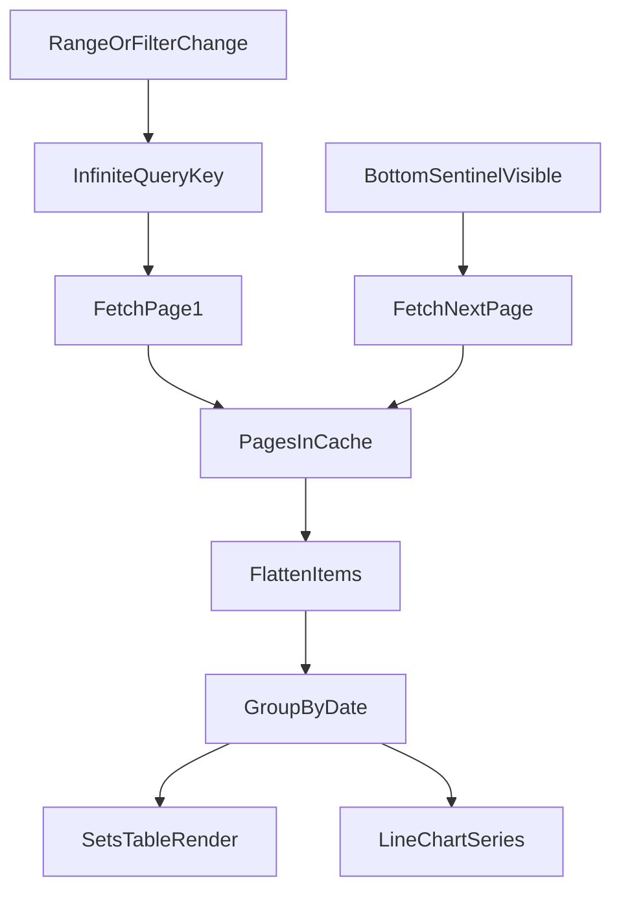

# TanStack Infinite Scroll Plan (ExerciseDetails -> SetsTable)

You chose true infinite loading for `ExerciseDetails -> SetsTable`, so this plan assumes backend pagination support first, then `useInfiniteQuery` on frontend.

## 1) Define API pagination contract (backend-first)

- Add pagination support to `GET /set` using either:
  - Cursor-based (recommended): `cursor` + `limit`, sorted by `createdAt desc, _id desc`
  - or offset-based: `skip` + `limit` (simpler, less stable under concurrent writes)
- Response shape should include:
  - `items: Set[]`
  - `nextCursor: string | null` (or `hasMore: boolean` for offset mode)
- Keep existing filters (`exerciseId`, `userId`, `from`, `to`) fully compatible.

## 2) Extend frontend filter types and service

- Update `src/types/setFilter/SetFilter.ts`:
  - add pagination params (`limit`, and `cursor` or `skip`)
- Keep `src/services/set/set.service.ts` `query(filterBy)` as-is structurally (it already forwards params), but type its response for paged shape if backend changes response from plain array.

## 3) Install and bootstrap TanStack Query

- Add dependency in `package.json`: `@tanstack/react-query`
- Wrap app with `QueryClientProvider` in `src/main.tsx`
- Create a single shared `QueryClient` instance with sensible defaults (`staleTime`, retry).

## 4) Start implementation with `useSets`

- Implement `src/hooks/useSets.ts` as the feature-level data hook using `useInfiniteQuery`.
- Hook responsibilities:
  - query key pattern:
    - `['exerciseSets', exerciseId, userId, fromISO, toISO, range]`
  - queryFn sends current page param (`cursor`/`skip`) via `setService.query`
  - `getNextPageParam` reads `nextCursor` (or computes next skip)
  - flatten pages to one sets array
  - expose `fetchNextPage`, `hasNextPage`, `isFetchingNextPage`, `isLoading`, `error`
- Keep grouping logic (`groupSetsByDate`) in `ExerciseDetails` for now, unless we decide to move transformation logic into `useSets` later.

## 5) Add reusable scroll trigger hook (`useInfiniteScrollTrigger`)

- Use `src/hooks/useInfiniteScrollTrigger.ts` as a generic IntersectionObserver trigger hook.
- Keep it data-layer agnostic:
  - inputs: `hasMore`, `isLoading`, `onLoadMore`, optional observer config
  - output: `sentinelRef`
- `useSets` wraps data fetching; UI components wire `useSets` + `useInfiniteScrollTrigger` together.

## 6) Integrate `useSets` into `ExerciseDetails`

- Refactor `src/components/ExerciseDetails/ExerciseDetails.tsx`:
  - replace sets `useEffect` + local fetch state with `useSets(...)`
  - consume `items` (flattened sets) and derive `groupedSets`
  - pass pagination/loading controls to `SetsTable`
- On range/exercise/user change, `useSets` query key changes automatically and resets pages.

## 7) Update `SetsTable` for sentinel-based load more

- Update `src/components/SetsTable/SetsTable.tsx` to accept:
  - `onLoadMore`
  - `hasNextPage`
  - `isFetchingNextPage`
  - optional `sentinelRef` (or attach sentinel internally and call hook there)
- Add a bottom sentinel row and trigger loading when it becomes visible.

## 8) Keep chart behavior stable while table paginates

- In `src/components/ExerciseDetails/ExerciseDetails.tsx`, decide one of:
  - Preferred: keep chart derived from all currently loaded pages and allow it to progressively enrich as user scrolls.
  - Alternative: separate query for chart (full range/capped), independent from table pagination.
- For first pass, use a single infinite query for both unless you explicitly want chart to be complete immediately.

## 9) UX and loading states

- `SetsTable`:
  - bottom loader when fetching next page
  - end-of-list message when no more pages
- `ExerciseDetails`:
  - initial loading skeleton/spinner
  - empty state only when first page is empty

## 10) Validation checklist

- Range changes (`1M`, `3M`, etc.) reset pages and fetch from first page.
- Scrolling fetches next page exactly once per threshold.
- No duplicates between page boundaries.
- Chart and past sessions remain in sync with selected range.

## Suggested data flow

